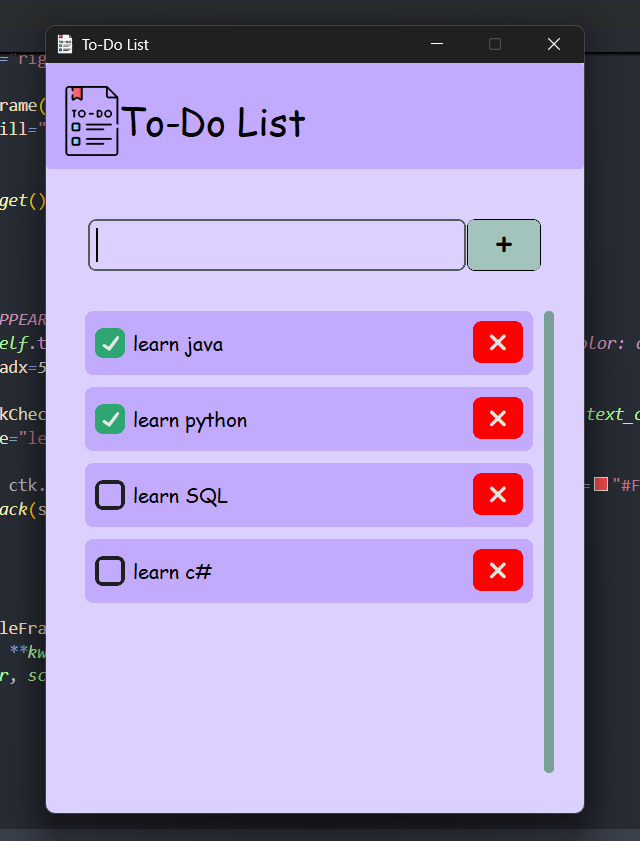

✅ To-Do List App

A fun, simple, and clean To-Do List desktop application made with Python

This app allows users to stay organized by adding and removing tasks in a friendly and aesthetic interface — perfect for personal projects, school tasks, or just keeping track of daily goals. 📝🌟

---

🎨 Features

- 🖼️ Sleek UI/UX with soft colors and icons
- ➕ Add new tasks easily
- ❌ Remove tasks with a single click
- ☑️ Scrollable task list with checkboxes
- 💡 Kinda modern/aesthetic/nostalgic GUI vibes

---

📷 Preview



---

🛠️ Tech Stack

- Python
- 🎨 Fonts: Comic Sans MS
- 💾 (Coming soon) SQLite database integration!

---

📌 Upcoming Features

- [ ] Persistent tasks using SQLite
  → Tasks will automatically **save** to a local database and **load** back in when the app is reopened!  
  → Never lose your list again — even after closing the app 💾✨

---

💻 🚀 How to Run

1. Clone the repository:
   ```bash
   git clone https://github.com/Zenobu0224/To-Do-List.git
   cd ToDoList
